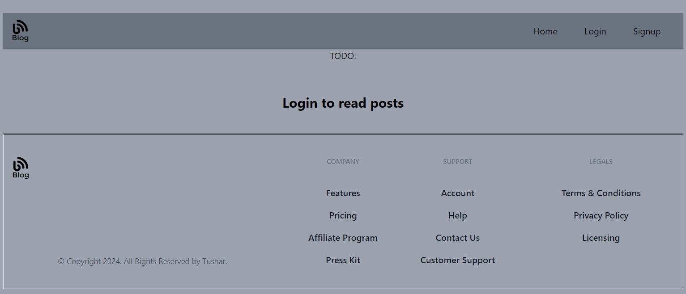
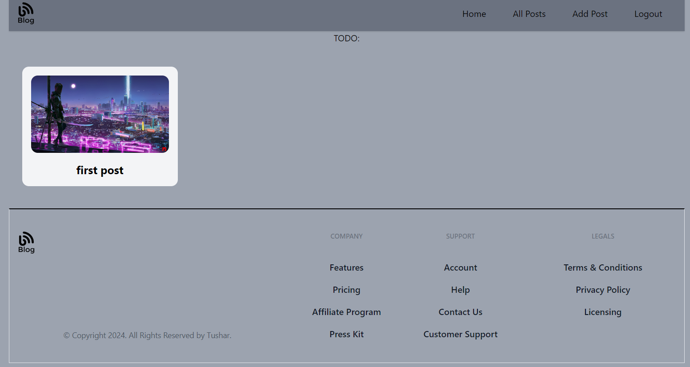
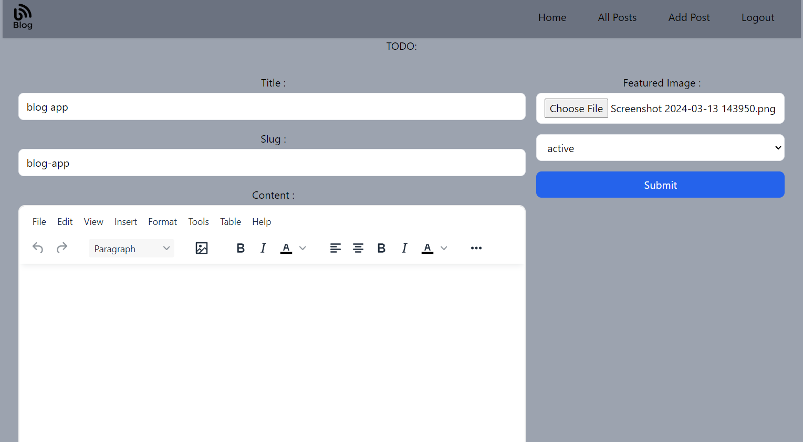
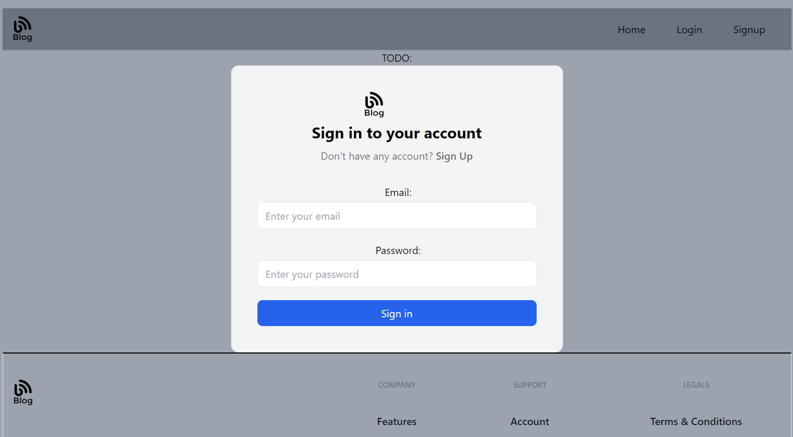
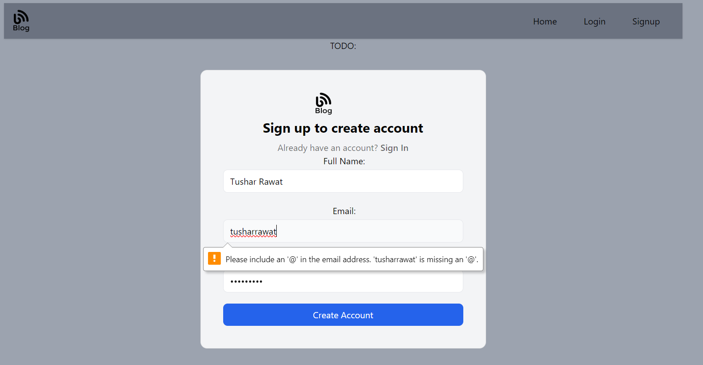

# Blog App

Blog App is a web application designed to empower users to create and manage their own blogs effortlessly.

## Key Features

- **User Authentication:** Allows users to sign up, log in, and manage their accounts securely.
- **Blog Creation:** Users can create, edit, and delete their blog posts.
- **Post Management:** Provides functionalities for managing posts, including editing, deleting, and categorizing.
- **Database Management:** Utilizes Appwrite (BaaS) for database storage and management.

## Tools Used

- **Appwrite (BaaS):** Used for Authentication, Database, and Storage purposes.
- **JavaScript:** Programming Language.
- **React:** JavaScript library used for building user interfaces.
- **Tailwind CSS:** Utilized for styling components using CSS-in-JS approach.
- **Vite:** Bundler for building the application.
- **reduxjs/toolkit:** Used to create a global state management store.
- **react-router-dom:** Provides client-side routing for the application.
- **react-hook-form:** Library for handling and validating forms.
- **html-react-parser:** Utilized to parse HTML tags.
- **tinymce-react:** Component used for creating or editing rich text content.

## Screenshots

### Home Page (Before Login)


### Home Page (After Login)


### Add Post Page


### Login Page


### Sign Up Page


## Installation

To install dependencies, run:

```bash
npm install
